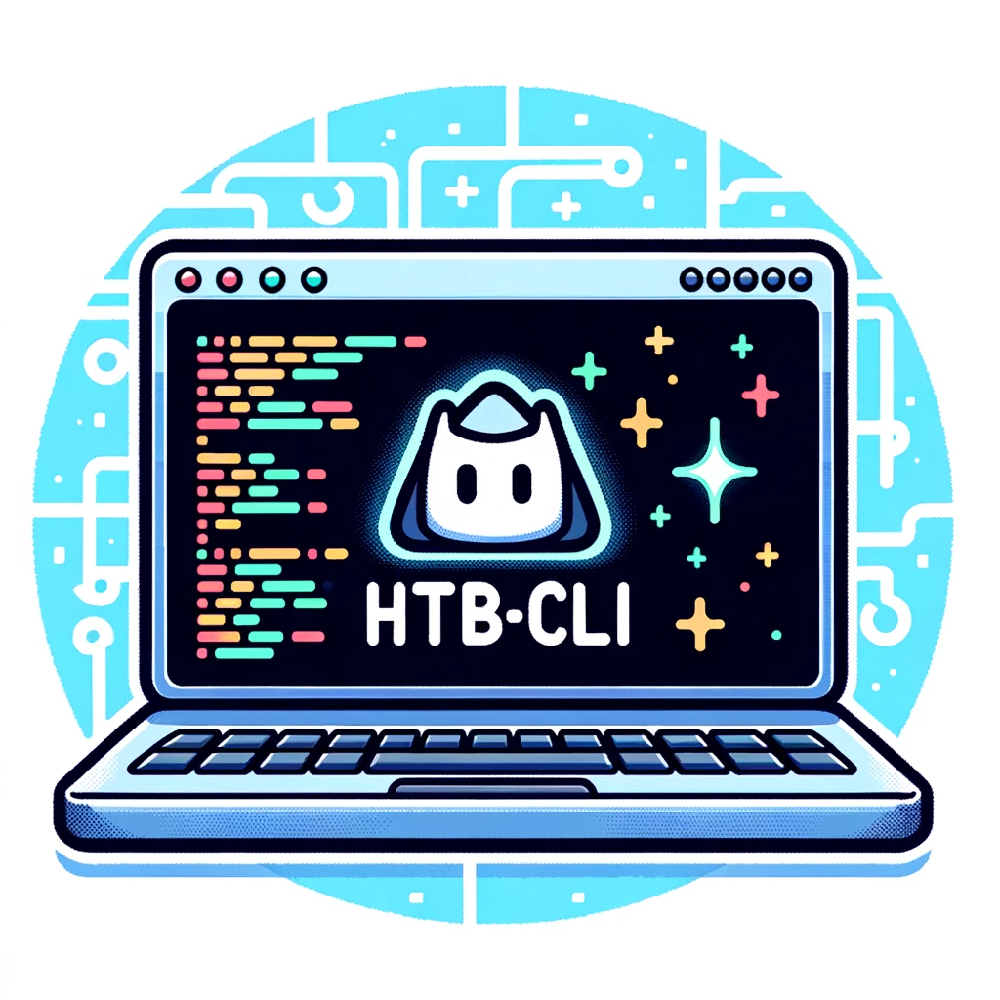

# htb-cli


<a target="_blank" rel="noopener noreferrer" href="https://twitter.com/QU35T_TV" title="Follow"></a>

<div>
  
  
  
  <br>
  
  
</div>

<div align="center">
  
</div></br>

## Installation

`go install github.com/GoToolSharing/htb-cli@latest`

## Completion

```bash
❯ htb-cli completion zsh > ~/.local/htb-cli/completion
❯ source ~/.local/htb-cli/completion
```

```bash
❯ htb-cli [TAB]
help        -- Help about any command
```

## Configuration

In order to use `htb-cli`, you need to generate a **HackTheBox application token**. This token can be generated via your account configuration page: https://app.hackthebox.com/profile/settings, then by clicking on `Create App Token`.

This API token must be set in the **HTB_TOKEN** environment variable. You can add it directly to your `bashrc / zshrc` to make it permanent.

```
export HTB_TOKEN=eyJ...
```

A default configuration file is created the first time the tool is running : `$HOME/.local/htb-cli/default.conf`.
This is a `Key / Value` configuration file.

### Discord

Integration with `Discord webhooks` can be enabled by modifying the `Discord` key value via a `Discord webhook link`.
This allows the output of certain commands to be received on a discord server.
This feature is currently in `beta`, with further enhancements to come.

```
❯ cat ~/.local/htb-cli/default.conf                             

Discord = https://discord.com/api/webhooks/****************/**************************
```

## Commands

To exit a tview, press `CTRL + C`.

### Helper

```bash
❯ htb-cli help

This software, engineered using the Go programming language, serves to streamline and automate various tasks for the HackTheBox platform, enhancing user efficiency and productivity.

Usage:
  htb-cli [command]

Available Commands:
  completion  Generate completion script
  help        Help about any command
  info        Detailed information on challenges and machines
  machines    Displays active / retired machines and next machines to be released
  pwnbox      Interact with the pwnbox
  reset       Reset a machine
  sherlocks   Play Sherlocks mode (blue team)
  shoutbox    Displays shoutbox information in real time
  start       Start a machine
  status      Displays the status of hackthebox servers
  stop        Stop the current machine
  submit      Submit credentials (machines / challenges / arena)
  update      Check for updates
  version     Displays the current version
  vpn         Interact with HackTheBox VPNs

Flags:
  -b, --batch           Don't ask questions
  -h, --help            help for htb-cli
  -p, --proxy string    Configure a URL for an HTTP proxy
  -v, --verbose count   Verbose level

Use "htb-cli [command] --help" for more information about a command.
```

### shoutbox

The shoutbox allows you to view player submissions in real time.

```bash
❯ htb-cli shoutbox

[Dec 24 22:50] - ComBeat solved challenge Diagnostic from Forensics
[Dec 24 22:50] - cledmir owned root on Crocodile
```

### sherlocks

The `sherlocks` command lets you interact with HackTheBox's `blue team` mode.
If no argument is given, you'll get information on `active`, `retired` and `soon-to-be-released` sherlocks.


You can add the `-s` argument to search for a sherlock with its name or part of its name, and the fuzzy finder will do the rest !
Another optional argument is `--download` or `-d`, which allows you to download the resource associated with the sherlock.


To submit the answers for each task, you can add the `-t` / `--task` flag followed by the task number.


Finally, the `--hint` flag can be added to provide a `hint`. If available, it will be displayed above the masked flag when a task is selected.

### info

The `info` command will retrieve information from the active machine (if any) and display it. If no argument is supplied, the logged-in user's information will be displayed.
You can combine machines / challenges and users.

```bash
Flags:
  -c, --challenge strings   Challenge name
  -h, --help                help for info
  -m, --machine strings     Machine name
  -u, --username strings    Username

Global Flags:
  -b, --batch          Allows all questions
  -p, --proxy string   Configure a URL for an HTTP proxy
  -v, --verbose        Verbose mode
```


```bash
❯ htb-cli info -c test -m Sau -u Yakei

? Do you want to check for active machine? No
? The following machine was found : Sau Yes
Name   |OS      |Retired   |Difficulty   |Stars   |IP          |Status        |Last Reset       |Release
Sau    |Linux   |No        |Easy         |4.6     |Undefined   |User & Root   |1 month before   |2023-07-08
? The following challenge was found : Leet Test Yes
Name        |Category   |Retired   |Difficulty   |Stars   |Solves   |Status     |Release
Leet Test   |Pwn        |Yes       |Easy         |4.9     |256      |No flags   |2020-11-18
? The following username was found : Yakei Yes
```

### machines

The `machines` command displays the list of active machines, the last 20 machines removed and the next machines planned.
The command requires no arguments.

```bash
❯ htb-cli machines
```


### start

The `start` command starts an instance for a machine. The machine name must be specified using the `-m` or `--machine` argument. Once started, its IP address is displayed.

```bash
Flags:
  -h, --help             help for start
  -m, --machine string   Machine name

Global Flags:
  -b, --batch          Allows all questions
  -p, --proxy string   Configure a URL for an HTTP proxy
  -v, --verbose        Verbose mode
```

If no flag is submitted, htb-cli starts the machine in `release arena`.

```bash
❯ htb-cli start

Machine spawned! Playing on the competitive server
Target: 10.129.254.131
```

```bash
❯ htb-cli start -m Visual

? The following machine was found : Visual Yes
Machine deployed to lab. Playing on a VIP server
Target: 10.10.11.234
```

### stop

The `stop` command is used to stop a machine instance. No arguments are required. The current machine will be stopped.

```bash
❯ htb-cli stop

Machine terminated. VIP server available
```

### reset

The `reset` command is used to request the reset of an instance. No arguments are required. The reset request will be made for the current machine.

```bash
❯ htb-cli reset   

No active machine found
```

### status

The `status` command displays the status of hackthebox servers.

```bash
❯ htb-cli status

All Systems Operational
```

### submit

The `submit` command is used to submit a flag. Currently, the following submissions are supported :

* VIP machines
* VIP+ machines
* Machines Free
* Release Arena
* Challenges

If there is no `--machine` or `--challenge` flag, submission will be made on the current active machine. Otherwise, this can be specified with the `--machine` and `--challenge` flags.

```bash
❯ htb-cli submit -d 3

No machine is running
```

```bash
❯ htb-cli submit -c test -d 3

? The following challenge was found : Leet Test Yes
Flag :
Incorrect flag
```

```bash
❯ htb-cli submit -m Sau -d 3

? The following machine was found : Sau Yes
Flag :
Incorrect flag!
```

### vpn

The vpn command downloads VPNs from HackTheBox.
The `--download` flag downloads all VPNs assigned to the user.

```bash
❯ htb-cli vpn --download

VPN : EU_VIP_7 downloaded successfully
VPN : EU_StartingPoint_VIP_1 downloaded successfully
VPN : EU_Endgame_VIP_1 downloaded successfully
VPN : EU_Fortress_1 downloaded successfully
VPN : EU_Release_Arena_1 downloaded successfully

VPNs are located at the following path : /home/qu35t/.local/htb-cli
```

The VPNs used can be listed with the `--list` flag

```bash
❯ htb-cli vpn --list

Product: endgames
No information available

Product: labs
ID: 201
Friendly Name: EU Free 2
Current Clients: 23
Location: EU - Free

Product: starting_point
ID: 440
Friendly Name: EU StartingPoint 2
Current Clients: 104
Location: EU - Starting Point

Product: competitive
ID: 201
Friendly Name: EU Free 2
Current Clients: 23
Location: EU - Free

Product: fortresses
No information available
```

A VPN can be started with the `--start` flag

```bash
❯ htb-cli vpn -m labs --start

VPN is starting...
VPN Started Successfully!
```

We can also stop it with the `--stop` flag

```bash
❯ htb-cli vpn --stop

Stopping VPN if any HackTheBox connection is found...
Killed HackTheBox VPN process 48492
Killed HackTheBox VPN process 48494
```

```bash
❯ ls -la ~/.local/htb-cli

total 72
drwxr-xr-x 2 qu35t qu35t 4096 12 nov.  17:51 .
drwxr-xr-x 5 qu35t qu35t 4096 10 nov.  14:32 ..
-rw-r--r-- 1 qu35t qu35t  149  7 nov.  15:12 default.conf
-rw-r--r-- 1 qu35t qu35t 9328 12 nov.  17:55 EU_Endgame_VIP_1-vpn.ovpn
-rw-r--r-- 1 qu35t qu35t 8435 12 nov.  17:55 EU_Fortress_1-vpn.ovpn
-rw-r--r-- 1 qu35t qu35t 9324 12 nov.  17:55 EU_Release_Arena_1-vpn.ovpn
-rw-r--r-- 1 qu35t qu35t 8454 12 nov.  17:55 EU_StartingPoint_VIP_1-vpn.ovpn
-rw-r--r-- 1 qu35t qu35t 9324 12 nov.  17:55 EU_VIP_7-vpn.ovpn
```