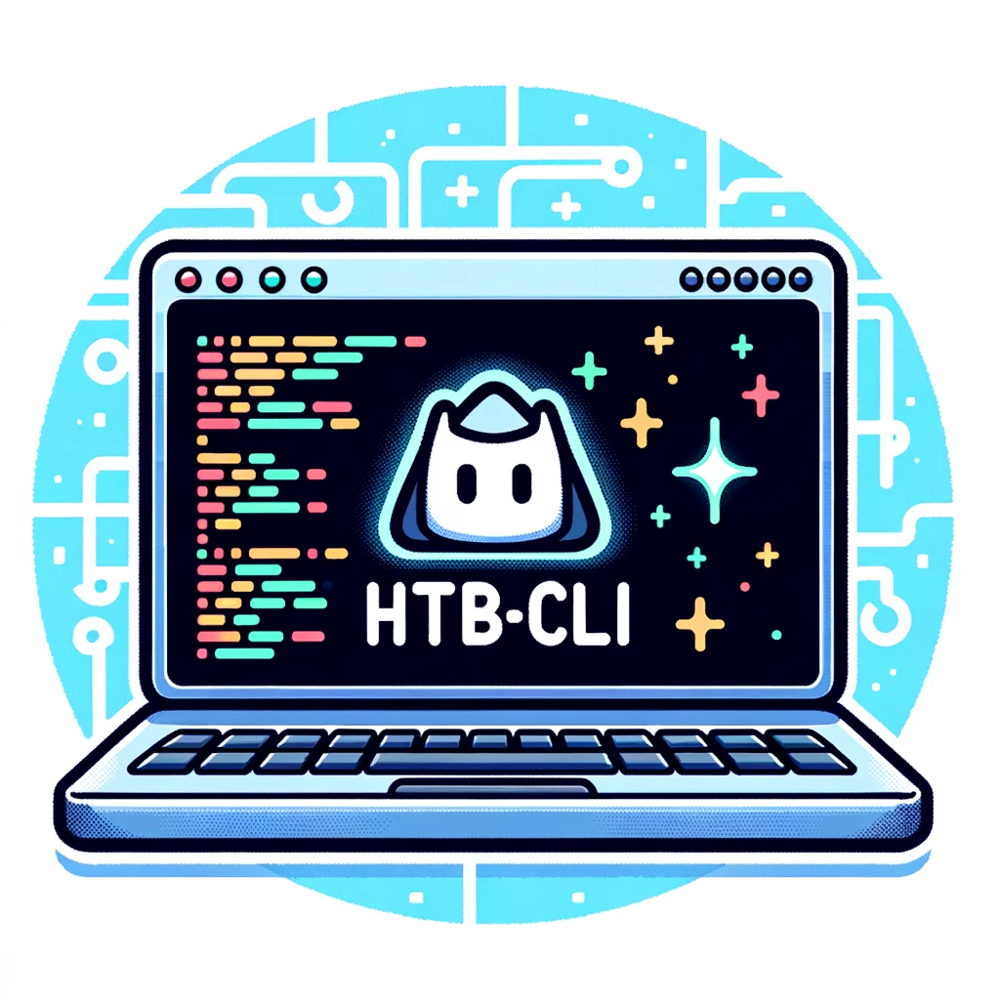

# htb-cli


<a target="_blank" rel="noopener noreferrer" href="https://twitter.com/QU35T_TV" title="Follow"></a>

<div>
  
  
  
  <br>
  
  
</div>

<div align="center">
  
</div></br>

# Upstream documentation

This fork descends from [GoToolSharing/htb-cli](https://github.com/GoToolSharing/htb-cli). Its documentation is hosted at <https://htb-cli-documentation.qu35t.pw/>; API details there may lag behind HTB changes and this maintained fork.

## What this checkout is for

This checkout is based on upstream's newer `dev` branch rather than the stale `v1.7.0` release. It keeps the CLI small while repairing the parts needed for repeatable HTB machine benchmarking:

- current API v5 machine-flag submission;
- TLS certificate verification and bounded HTTP requests;
- useful HTTP/API errors instead of HTML-to-JSON crashes;
- best-effort update checks that cannot block normal commands;
- no flag or request-body logging;
- upstream `dev` fixes for machine status, spawn waiting, caching, and non-interactive submission.

This is an unofficial client for an API that can change without notice. Run destructive commands only against machines you are authorized to operate.

## Install from this checkout

Requirements: Go 1.26.5 or newer and a C compiler for the SQLite dependency used by the `dev` branch. Older Go installations can download the required toolchain automatically when `GOTOOLCHAIN=auto` is enabled.

```bash
go test ./...
go vet ./...
go install .
```

`go install .` writes `htb-cli` to `GOBIN`, or to `$(go env GOPATH)/bin` when `GOBIN` is unset. Add that directory to `PATH`, then verify:

```bash
htb-cli --no-check version
```

To install explicitly into a directory already on `PATH`:

```bash
GOBIN="$HOME/.local/bin" go install .
```

After this maintenance branch is published, it can also be installed without cloning:

```bash
go install github.com/PentestGPT-Project/htb-cli@maintenance/benchmark-cli
```

## Authentication and local state

Create an HTB application token in the Hack The Box account settings and expose it as `HTB_TOKEN`. Do not commit it or place it directly in command history.

For a temporary interactive shell:

```bash
read -rsp "HTB app token: " HTB_TOKEN
export HTB_TOKEN
```

The first real command creates local state under:

```text
~/.local/htb-cli/
├── default.conf
└── htb-cli.db
```

The token is not stored there. The optional Discord webhook belongs in `default.conf`; keep that file private if configured.

## Recommended machine workflow

Use `--no-check` (`-n`) for automation so GitHub availability is irrelevant. Use `--batch` (`-b`) only when automatic confirmation is intended.

```bash
# Confirm authentication, subscription, VPN, and active-machine state.
htb-cli --no-check --batch status

# Spawn a named machine and wait for its address.
htb-cli --no-check --batch start --machine MACHINE_NAME

# Re-check the active instance.
htb-cli --no-check --batch status

# Reset it only when a clean instance is required.
htb-cli --no-check --batch reset

# Submit interactively; the flag prompt does not echo.
htb-cli --no-check --batch submit --machine MACHINE_NAME

# Stop the active machine after any required flag submission.
htb-cli --no-check --batch stop
```

Machine flags rotate when an instance is respawned. Submit a captured flag before stopping the instance that produced it.

With no mode option, `submit` targets the active machine. The newer upstream branch also accepts `--flag`, but passing a secret in an argument exposes it to shell history and process inspection; prefer the interactive prompt. Challenge submission uses a 1–10 difficulty rating:

```bash
htb-cli --no-check submit --challenge CHALLENGE_NAME --difficulty 5
```

## Common commands

| Command | Purpose |
|---|---|
| `htb-cli -n -b status` | Show account, VPN, and active-machine status. |
| `htb-cli -n info` | Show the current account and optionally the active machine. |
| `htb-cli -n info -m NAME` | Look up one or more machines. |
| `htb-cli -n machines` | Open the interactive active/retired/scheduled machine view. |
| `htb-cli -n start -m NAME` | Spawn a named machine. With no name, request the release-arena machine. |
| `htb-cli -n reset` | Reset the active machine. |
| `htb-cli -n stop` | Stop the active machine. |
| `htb-cli -n submit` | Submit a flag for the active machine. |
| `htb-cli -n vpn --list` | List available VPN products. |
| `htb-cli -n vpn --download` | Download permitted VPN profiles into the CLI state directory. |
| `htb-cli -n vpn --start -m labs` | Start a downloaded labs VPN; normally requires `sudo` and OpenVPN. |
| `htb-cli -n vpn --stop` | Stop the VPN process started by the CLI. |
| `htb-cli completion zsh` | Generate shell completion. |

Global options can appear before or after the subcommand:

- `--batch`, `-b`: accept confirmation prompts automatically;
- `--no-check`, `-n`: skip the GitHub release check;
- `--proxy URL`: use an HTTP(S) proxy; its CA must be trusted by the operating system;
- `-v` / `-vv`: informational or debug logging. Secrets are excluded from maintained debug logs.

Run `htb-cli COMMAND --help` for the authoritative flags supported by the installed binary.

## Known limitations

- HTB does not provide a stable public contract for all Labs endpoints. Lifecycle commands need periodic read-only qualification.
- The API is mixed-version: most operations remain on v4, while machine ownership is on v5.
- Most output is human-oriented rather than structured JSON, so automation should rely on exit status sparingly.
- Some older response parsing still uses dynamic type assertions and can fail if HTB changes a successful JSON shape.
- `getflag` is Linux-oriented, accepts an SSH password in an argument, disables SSH host-key verification, and has unresolved upstream validation issues. Do not use it in the benchmark workflow.
- Pwnbox start is not implemented because HTB requires browser-side reCAPTCHA. `shoutbox` is deprecated.
- `machines`, Sherlock tasks, and interactive flag entry require a terminal.
- Development builds report version `dev` and intentionally skip the GitHub release check until the fork publishes a tagged release.

## Maintaining a fork

Keep the writable fork and read-only source history distinct:

```bash
git remote -v
# origin   git@github.com:PentestGPT-Project/htb-cli.git
# upstream git@github.com:GoToolSharing/htb-cli.git
```

To incorporate future upstream work, fetch it explicitly and rebase a maintenance branch only after reviewing the incoming diff:

```bash
git fetch upstream --prune
git rebase upstream/dev
```

The Go module path, internal imports, update checker, and installation examples use the fork identity. Keep them synchronized if the repository moves again.

Qualification order for API changes:

```bash
go test ./...
go vet ./...
go build ./...
go run golang.org/x/vuln/cmd/govulncheck@latest ./...
htb-cli --no-check --batch status
```

The first three checks are offline after dependencies and the pinned toolchain are cached. `govulncheck` reads the official Go vulnerability database. The final command is an authenticated, read-only smoke test; do not use spawn, reset, submit, or stop as a diagnostic probe.
