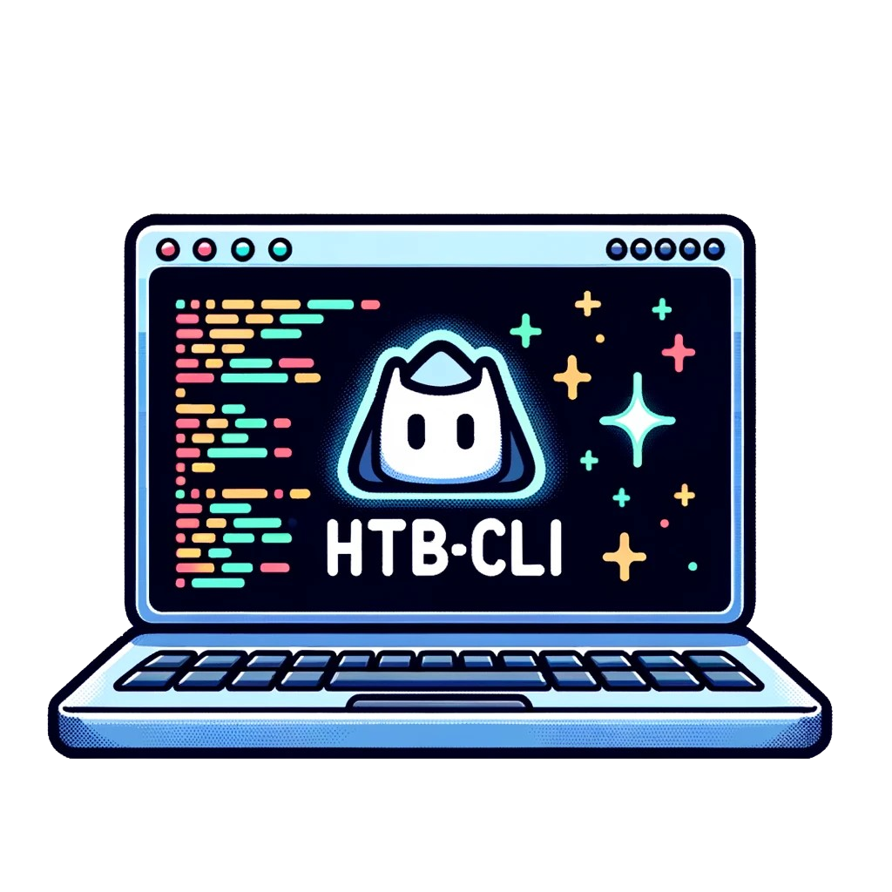

# htb-cli


<div>
  
  
  
  <br>
  
  
</div>

<div align="center">
  
</div></br>

## Installation

`go install github.com/GoToolSharing/htb-cli@latest`

## Configuration

In order to use `htb-cli`, you need to generate a **HackTheBox application token**. This token can be generated via your account configuration page: https://app.hackthebox.com/profile/settings, then by clicking on `Create App Token`.

This API token must be set in the **HTB_TOKEN** environment variable. You can add it directly to your `bashrc / zshrc` to make it permanent.

```
export HTB_TOKEN=eyJ...
```

## Commands

To exit a tview, press `CTRL + C`.

### Helper

```bash
❯ htb-cli help

This software, engineered using the Go programming language, serves to streamline and automate various tasks for the HackTheBox platform, enhancing user efficiency and productivity.

Usage:
  htb-cli [command]

Available Commands:
  help        Help about any command
  info        Detailed information on challenges and machines
  machines    Displays active / retired machines and next machines to be released
  reset       Reset a machine
  start       Start a machine
  status      Displays the status of hackthebox servers
  stop        Stop the current machine
  submit      Submit credentials (machines / challenges / arena)

Flags:
  -b, --batch          Don't ask questions
  -h, --help           help for htb-cli
  -p, --proxy string   Configure a URL for an HTTP proxy
  -v, --verbose        Verbose mode

Use "htb-cli [command] --help" for more information about a command.
```

### info

The `info` command will retrieve information from the active machine (if any) and display it. If no argument is supplied, the logged-in user's information will be displayed.
You can combine machines / challenges and users.

```bash
Flags:
  -c, --challenge strings   Challenge name
  -h, --help                help for info
  -m, --machine strings     Machine name
  -u, --username strings    Username

Global Flags:
  -b, --batch          Allows all questions
  -p, --proxy string   Configure a URL for an HTTP proxy
  -v, --verbose        Verbose mode
```

```bash
❯ htb-cli info

? Do you want to check for active machine ? No

? The following username was found : QU35T3190 Yes
```

```bash
❯ htb-cli info -c test -m Sau -u Yakei

? Do you want to check for active machine? No
? The following machine was found : Sau Yes
Name   |OS      |Retired   |Difficulty   |Stars   |IP          |Status        |Last Reset       |Release
Sau    |Linux   |No        |Easy         |4.6     |Undefined   |User & Root   |1 month before   |2023-07-08
? The following challenge was found : Leet Test Yes
Name        |Category   |Retired   |Difficulty   |Stars   |Solves   |Status     |Release
Leet Test   |Pwn        |Yes       |Easy         |4.9     |256      |No flags   |2020-11-18
? The following username was found : Yakei Yes
```

### machines

The `machines` command displays the list of active machines, the last 20 machines removed and the next machines planned.
The command requires no arguments.

```bash
❯ htb-cli machines
```

### start

The `start` command starts an instance for a machine. The machine name must be specified using the `-m` or `--machine` argument. Once started, its IP address is displayed.

```bash
Flags:
  -h, --help             help for start
  -m, --machine string   Machine name

Global Flags:
  -b, --batch          Allows all questions
  -p, --proxy string   Configure a URL for an HTTP proxy
  -v, --verbose        Verbose mode
```

```bash
❯ htb-cli start -m Visual

? The following machine was found : Visual Yes
Machine deployed to lab. Playing on a VIP server
Target: 10.10.11.234
```

### stop

The `stop` command is used to stop a machine instance. No arguments are required. The current machine will be stopped.

```bash
❯ htb-cli stop

Machine terminated. VIP server available
```

### reset

The `reset` command is used to request the reset of an instance. No arguments are required. The reset request will be made for the current machine.

```bash
❯ htb-cli reset   

No active machine found
```

### status

The `status` command displays the status of hackthebox servers.

```bash
❯ htb-cli status

All Systems Operational
```

### submit

The `submit` command is used to submit a flag. Currently, the following submissions are supported :

* VIP machines
* VIP+ machines
* Machines Free
* Release Arena
* Challenges

If there is no `--machine` or `--challenge` flag, submission will be made on the current active machine. Otherwise, this can be specified with the `--machine` and `--challenge` flags.

```bash
❯ htb-cli submit -f flag4testing -d 3

No machine is running
```

```bash
❯ htb-cli submit -c test -f flag4testing -d 3

? The following challenge was found : Leet Test Yes
Incorrect flag
```

```bash
❯ htb-cli submit -m Sau -f flag4testing -d 3

? The following machine was found : Sau Yes
Incorrect flag!
```